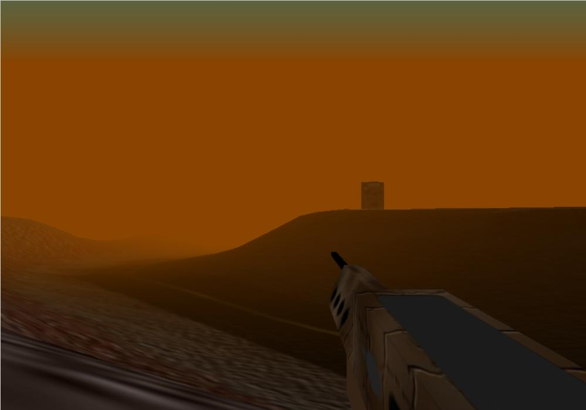



## A 3D Landscape\-Game Engine, similar to Delta Force

### Description

[UPDATED 15-4-2003] This is a Engine using DirectX 8, and it has an infinite Terrain (really!! :)), Perfect collision detection, Guns that "stick" to the Screen, Shadows, Water, Sound effects. It loads from a custom model file (actually a text file :)) and you can modify the "mission", just by using a notepad. !!!!!!!!WARNING!!!!!!!!!!!! IMPORTANT: DON'T enable shadows when you didn't do a full compile, it will take like forever to load. Even with a full compile, the program takes over 1 minute to load on my 1.7 GHz comp... Take caution ;). This program was designed for a Screen Resolution of 1600x1400, but it looks ok with a 1024x768 too, but you can't see the HUD. Lower Resolution don't show much of the program. If you weren't able to download it, go to my website: www.sturmnacht.de.vu The FIle is over 1 Meg.
 
### More Info
 

             |
---                |---
**Submitted On**   |2003-03-10 19:29:46
**By**             |[\<\<ULTIMA\>\>](https://github.com/Planet-Source-Code/PSCIndex/blob/master/ByAuthor/ultima.md)
**Level**          |Advanced
**User Rating**    |4.9 (142 globes from 29 users)
**Compatibility**  |VB 5\.0, VB 6\.0
**Category**       |[DirectX](https://github.com/Planet-Source-Code/PSCIndex/blob/master/ByCategory/directx__1-44.md)
**World**          |[Visual Basic](https://github.com/Planet-Source-Code/PSCIndex/blob/master/ByWorld/visual-basic.md)
**Archive File**   |[A\_3D\_Lands1574054152003\.zip](https://github.com/Planet-Source-Code/ultima-a-3d-landscape-game-engine-similar-to-delta-force__1-42839/archive/master.zip)

